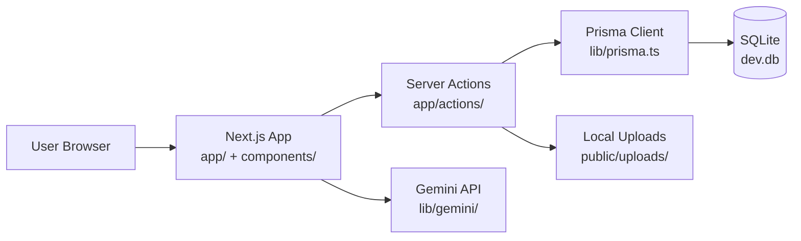

# Technical Architecture — Shelfi POC

## Purpose

This document describes the Shelfi retail intelligence POC architecture. Folder layout and agent conventions follow the Modula Tech `apps/web` frontend pattern, adapted for a standalone Next.js + Prisma app.

## Architecture Summary

- Standalone Next.js 16 App Router application
- SQLite database via Prisma 7
- Server actions for data mutations and reads
- Google Gemini for shelf image analysis
- No separate API server in this POC

## High-Level System Diagram

## Runtime Topology

### Web Application

Main responsibilities:

- Dashboard with product metrics and brand breakdown
- Shelf image upload and AI extraction workflow
- Persist extracted products to SQLite

Primary technologies:

- Next.js 16, React 19
- Tailwind CSS v4, shadcn/ui, Recharts
- Prisma with better-sqlite3 adapter

### Data Layer

- `Product` model stores extracted shelf line items
- Migrations under `prisma/migrations/`
- Generated client at `lib/generated/prisma/`

### AI Layer

- `lib/gemini/analyze-shelf-image.ts` sends images to Gemini
- Structured extraction mapped to `Product` fields

## Folder Conventions (Modula Tech aligned)

| Directory | Role |
|-----------|------|
| `app/` | Routes, layouts, server actions |
| `components/` | Feature and shared UI |
| `components/providers/` | Client-side root providers |
| `config/content/` | Copy and content config |
| `constants/` | Routes, app-wide constants |
| `contexts/` | React context modules |
| `hooks/` | Client hooks |
| `lib/` | Server utilities, types, integrations |

## Related Documentation

- `docs/module-tech-replication.md` — what was ported from Modula Tech
- `AGENTS.md` — agent coding and quality standards
- `GEMINI_PROJECT_CONTEXT.md` — concise project context for AI tools
